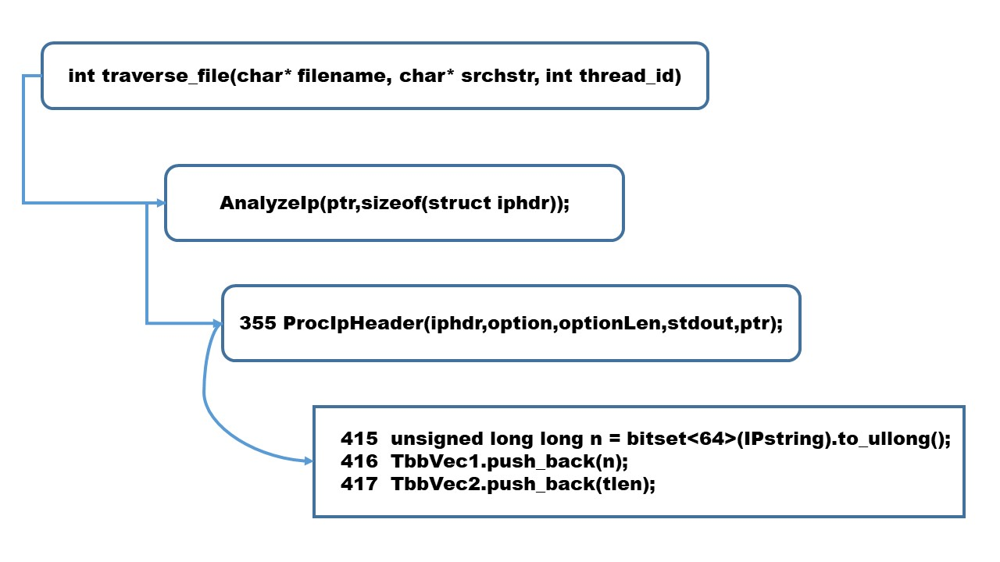

Asura 17: A GPU acclerated packets cluctering using highly concurrent container  

The rapid increase of security log has been imposing a great burden on security analysts and researchers. Particularly, in the recent several years, we are facing more and more the situation in which we cope with terabyte-scale traffic dump for various purposes such as network forensics, incident response and CTF. Unfortunately, the emergence of terabyte-scale PCAP file has nullified the effectiveness of the most of good old arts of concurrency. Many conventional techniques such as concurrent hashmap, atomic instruction and lock-based mechanism implemented on SIMD architecture are not so practical any longer in the struggle against terabyte-scale PCAP file.

  Asura 17 has a deep impact of "SMIT after SMID" parallelization over the anomaly detection of terabyte-scale traffic dump is reported. The good combination of SMIT and SMID parallelization outperforms the conventional art of concurrency, which enables us process a few terabyte PCAP file with the reasonable computing time.  For example, Asura can execute the anomaly detection of about 3,000,000,000 packets in around 800-1000 minutes (which is feasible for daily cron operation). Asura has two transformation combos (Pthreads→TBB, TBB→Thrust) for achieving drastically faster flow aggregation, feature vector extraction and clustering. SM

1.Lisence: Asura 17 is now released as open source under MIT license. 

2.Compiler and libraries: gcc version 7.3.0 (Ubuntu 7.3.0), Posix Pthreads and Intel TBB.

3.Input: PCAP files in the directory 

4.Usage: ./asura DIRECTORY_NAME

<pre>
	# mkdir pcap
        # cd pcap 
        # wget https://download.netresec.com/pcap/maccdc-2012/maccdc2012_*.pcap.gz
        # cd ..
	# ./build-asura.sh 
        # ./asura pcap
</pre>

5.Output: {<sourceIP, destinationIP>, Anomaly_Score}

<pre>
	sourceIP,destIP->clusterNo (length, counts), clusterSize, AllSize, Anomaly_score(%)
	X.X.X.X,Y.Y.Y.Y -> 7 (275912,48),46,118644,0.0387715%
　　　   X.X.X.X,Z.Z.Z.Z -> 5 (73445,48),288,118644,0.242743%
</pre>
　
*Packet dump was drastically reduced from 83GB to 7MB with about 110,000 extracted flow vectors which are useful for the further careful inspection by Wireshark.

6.Procedure 1: extracting flow vector {<srcIP, dstIP>, X, Y}
<pre>
	Container: typedef tbb::concurrent_vector<unsigned long long> iTbb_Vec1; iTbb_Vec1 TbbVec1;
		   typedef tbb::concurrent_vector<long> iTbb_Vec2; iTbb_Vec2 TbbVec2;
</pre>

<pre>
	Main loop: 
  	pthread_create(&master, NULL, (void*)master_func, (void*)&targ[0]);
    	  for (i = 1; i < thread_num; ++i) { 
        	targ[i].id = i;
       		pthread_create(&worker[i],NULL,(void*)worker_func,(void*)&targ[i]); }
    	  for (i = 1; i < thread_num; ++i) 
 	       pthread_join(worker[i], NULL);
</pre>

Insertion point of concurrent vector is located at ProcIpHeader.

<pre>
355: int ProcIpHeader(struct iphdr *iphdr,u_char *option,int optionLen,FILE *fp,u_char*ptr)
415:  unsigned long long n = bitset<64>(IPstring).to_ullong();
416:  TbbVec1.push_back(n);
417:  TbbVec2.push_back(tlen);
</pre>

<pre>
    std::remove("tmp-asura-1");
    ofstream outputfile1("tmp-asura-1");

    std::remove("tmp-asura-2");
    ofstream outputfile2("tmp-asura-2");

    tbb::concurrent_vector<unsigned long long>::iterator start1;
    tbb::concurrent_vector<unsigned long long>::iterator end1 = TbbVec1.end();

    tbb::concurrent_vector<long>::iterator start2;
    tbb::concurrent_vector<long>::iterator end2 = TbbVec2.end();
    
    // counter = 0;
    
    for(start1 = TbbVec1.begin();start1 != end1;++start1)
      {
	unsigned long long s = (unsigned long long)*start1;
	outputfile1 << s << "," << "1" << endl;
      }

    start2 = TbbVec2.begin();
    for(start1 = TbbVec1.begin();start1 != end1;++start1)
      {
	unsigned long long s = (unsigned long long)*start1;
	long t = (unsigned long long)*start2;
	
	outputfile2 << s << "," << t << endl;
	start2++;
      }

    outputfile1.close();
    outputfile2.close();
</pre>
